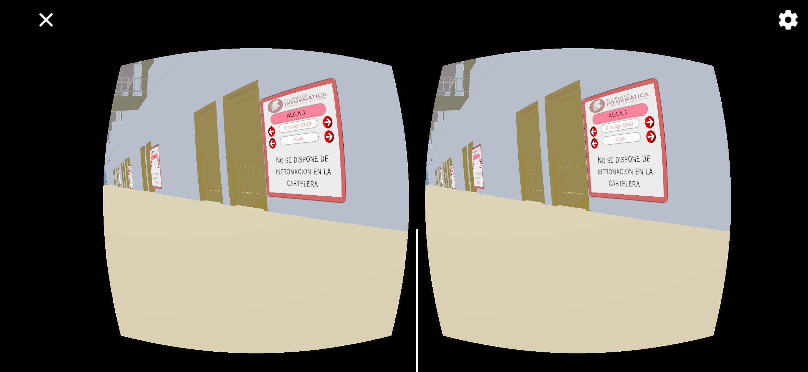

# 🎓 Expo Science VR-Project-Unity-2024

> **Project developed for the Institute of Computer Science Research (LIDI), part of the National University of La Plata (UNLP).**  
This project aimed to create an immersive experience for incoming students by providing a virtual tour of the Faculty facilities, helping them familiarize themselves with the layout.

The project was presented at **Expo Science 2024**, an event attended by University Authorities.

---

## 🏗️ Project Development

### 🔹 3D Modeling
- **Tool**: [Sweet Home 3D](https://www.sweethome3d.com/)  
- **Process**:  
   1. Updated the 3D model of the Faculty, built to scale using architectural blueprints.  
   2. Exported the model in `.obj` format for integration into Unity.  

### 🔹 Unity Implementation
- **Platform**: [Unity](https://unity.com/)  
- **Features**:
   - Virtual tour in **Virtual Reality** (VR).  
   - Signage system displaying:
     - Course names.
     - Current class schedules for each classroom.

---

## 🌟 Main Features

- **Compatibility**: Designed for devices running **Android 9** or higher.  
- **Hardware Support**: Compatible with **Google Cardboard** for an immersive virtual reality experience.

---

## 📸 Project Preview

---

## 👨‍🏫 Coordinators

- **Lic. Sebastián Dapoto**  
- **Lic. Federico Cristina**

---

## 👩‍💻 Programmers

- **Restucha, Tiago**  
- **Schwindt, Ignacio Andrés**  
- **Barbero, Lautaro**

---

## 🔗 Useful Links

  
  
  

## 📜 License

This project was developed as part of an academic initiative and has no usage restrictions from me or my parnerts. However, please credit **LIDI** and **UNLP** in any reproduction or presentation.

## 💬 Contact (LIDI)

  
  

 

